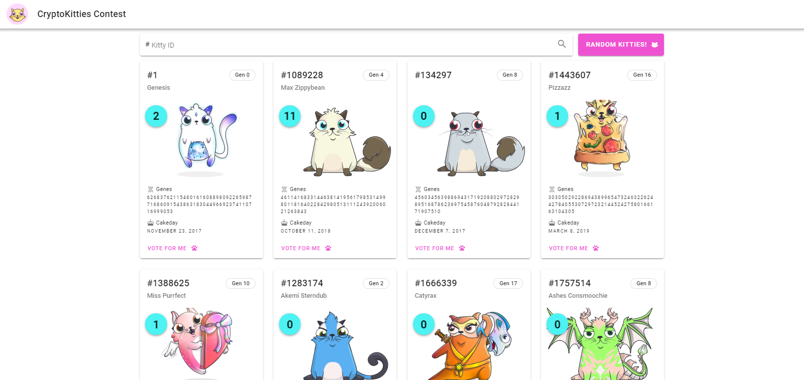
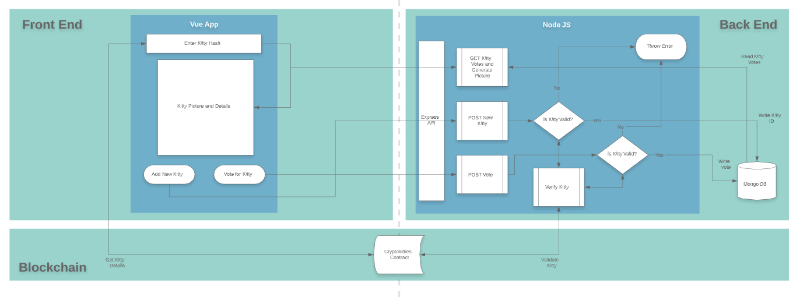

# cryptokitties-contest

> CryptoKitties Contest App

Who's the cutest CryptoKitty?

This simple web app demonstrates a simple implementetion of the MEVN stack (MongoDB, Express, Vue and Node) plus adding public Ethereum Blockchain data via web3 injection.



## Architecture Diagram:



- Every Kitty card is populated with info coming from the public Ethereum Blockchain, our own MongoDB and the CryptoKitties website API:
  - Kitties name, and picture come from the [CryptoKitties API](https://api.cryptokitties.co/kitties/1).
  - Kitties generation, genes and cakeday are read from the [Blockchain](https://etherscan.io/token/0x06012c8cf97bead5deae237070f9587f8e7a266d) .
  - Kitties added to the contest and their votes are stored on MongoDB.
- Validation of Kitty ID is handled reading the CryptoKitties smart contract.
- [Infura](https://infura.io) is used as web3 provider service since this simple app doesn't need to write on the blockchain.

## Express API:

Simple CRUD methods:

| Method | Endpoint              | Description                                             |
| ------ | --------------------- | ------------------------------------------------------- |
| POST   | /api/kitties          | Add Kitty ID to contest and initialize votes with cero. |
| GET    | /api/kitties          | Returns Array of kitties on contest and their votes.    |
| GET    | /api/kitties/:id      | Returns individual Kitty id and votes.                  |
| POST   | /api/kitties/:id/vote | Increments Kitty votes, returns kitty ID and votes.     |
| DELETE | /api/kitties/:id      | Removes Kitty from contest, returns status.             |

## Build Setup

```bash
# install dependencies
$ yarn install

# serve with hot reload at localhost:3000
$ yarn dev

# build for production and launch server
$ yarn build
$ yarn start

# generate static project
$ yarn generate
```

For detailed explanation on how things work, check out [Nuxt.js docs](https://nuxtjs.org).

## Deployment

For easy deployment, this app was containarized with a Dockerfile. MongoDB is orchestrated via docker-compose which also sets the needed enviroment viarables.

- ### Clone this repo

```bash

$ git clone https://github.com/delta575/cryptokitties-contest.git
$ cd cryptokitties-contest
```

- ### Set enviroment variables

```bash
$ cd cryptokitties-contest
$ cp .env.example .env
```

| Variable      | Description                                                                                        |
| ------------- | -------------------------------------------------------------------------------------------------- |
| BASE_URL      | Axios base URL, defaults to localhost, must be changed on deployment.                              |
| DATABASE_URL  | MondoDB URL, useful for development, override with docker-compose on deployment.                   |
| WEB3_PROVIDER | URL of web3 provider, you can use [Infura](https://infura.io).'s service or point to your own node |

- ### Deploy project

```bash
$ docker-compose up -d --build
```

- ### If you want to check the logs

```bash
$ docker-compose logs -f
```

- ### Stop project

```bash
$ docker-compose stop
```
